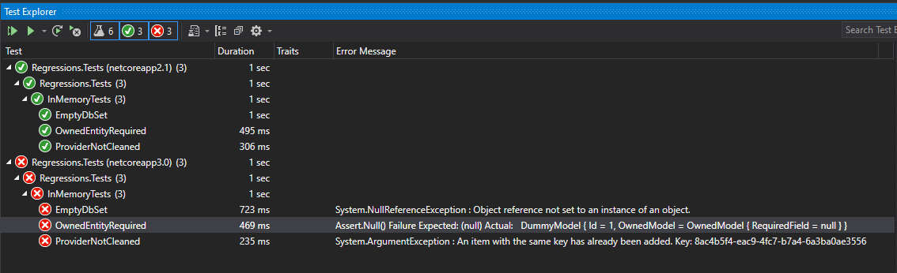

EF Core 3.0 preview7 regressions
================================

This repo contains a series of projects comparing current stable EF Core version 2.2.6 and 3.0.0 preview 7.
Demonstrating some (what I believe to be) regressions.

## How do my examples work?

I used .NET Core SDK and project multi-targeting in order to use the same code with both EF Core 2.2.6 and 3.0.0 preview 7. In some cases you have two sets of migrations per project per EF version, when it's needed.

Targets map to EF core versions as follows:

* For `classlib` projects

    * .NET Standard 2.0 = EF Core 2.2.6
    * .NET Standard 2.1 = EF Core 3.0.0 preview 7

* For `xUnit` projects

    * .NET Core App 2.1 = EF Core 2.2.6
    * .NET Core App 3.0 = EF Core 3.0.0 preview 7

## Prerequisites

* .NET Core SDK 3.0.0 preview 7
* Visual Studio 2019 16.2 (if you want to build and tests projects using VS)

## How do I use this repo?

Clone this repo and run `dotnet build` followed by `dotnet test` command.
Alternatively open the solution in the root folder of this repo with Visual Studio.